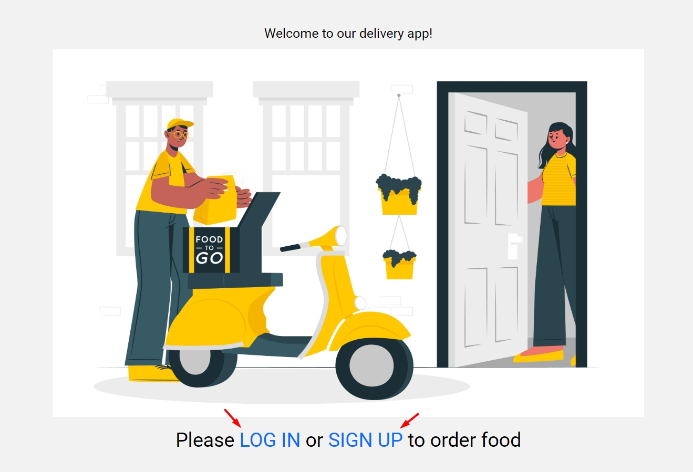
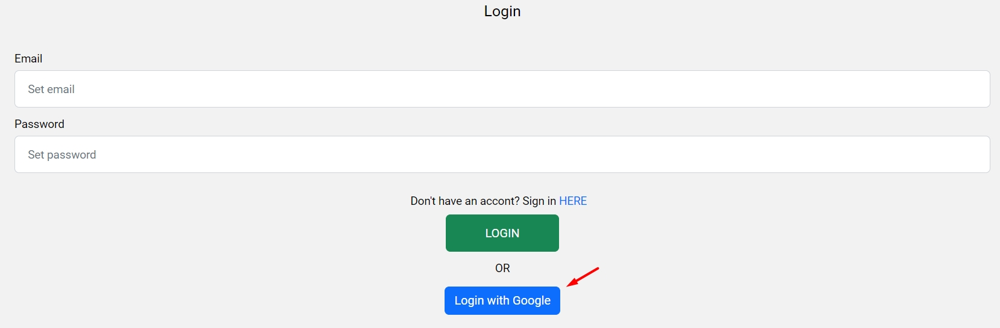
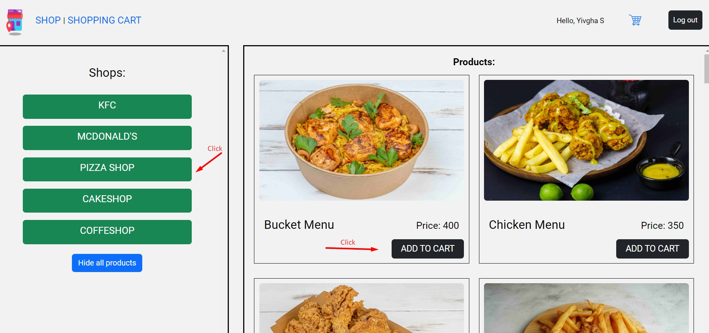
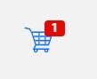
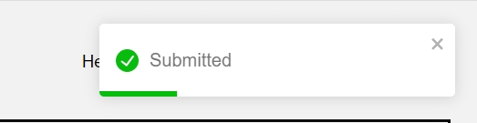
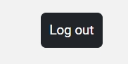

Order food online and get it delivered to you home via our web application!

After you open the app, you'll see a homepage. 

Sign up if it's your first time here or login with email/password or via Google account.

You'll be redirected to main shops page. On the left side you can see the list of all shops we're working with and on the right side - all products by all the shops. If you want to choose one particular shop, click on its name in the list and you'll see all its products to the right.

To add product to the cart, click on "Add to cart" button. If operation was successful, the toast appears and you will see red number icon in cart in the navbar.

To naviagate to the cart, click Shopping cart page or on the cart icon top right. You can increase, decrease or remove items from the cart.

Enter your name, email. phone and address in the form left, check your products quantity and total sum and click Submit button. If you want to cancel orded, click "Clear cart button".

After submit your orded will be transferred to our site and we can fast prepare and convey it to you!

If you ordered items, you can safely log out from the app. Please, avoid reloading page, it may cause some errors.

P. S. Our app is adapted to big PC/laptop screens (1200px and higher), tablets (768px) and to different mobile screens (320-480px) for better user experience!